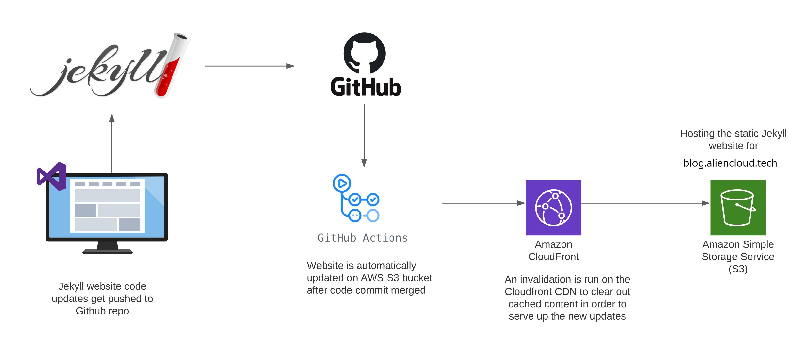
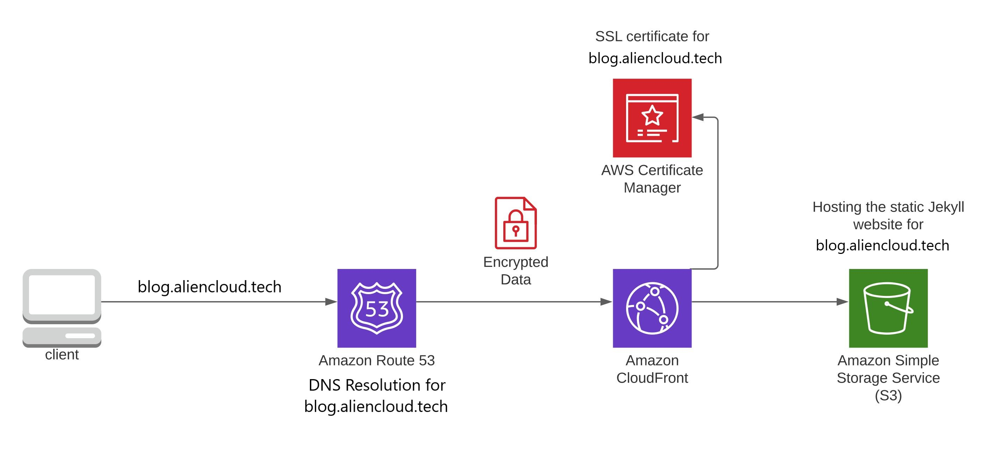

# Static Website Hosting on S3 Bucket with Github Actions CI/CD

Hosting static website on S3 bucket generated by Jekyll Static site Generator through CICD pipeline using Github Actions, Cloudfront CDN, Route53, AWS Certificate Manager.  


### Tools/Services used   

1. AWS (S3, CloudFront CDN, Route53, AWS Certificate Manager)  
2. Github Account 
3. Custom Domain name  

### CI/CD Workflow    

   

* User write/update the code for the Jekyll Website.  
* Now user commit and push the code on github repository with workflow file (.github/workflows/*.yml).   
* GitHub Actions trigger the CI/CD Workflow whenever a push is made to the main branch.   
* CI/CD Workflow uploads the output files from the Jekyll _site directory to the AWS S3 bucket.  
* CloudFront invalidation is run in order to clear out any cached content and immediately serve the updated S3 website content.   


### Accessing Blog/Website    

    

* Client request for the website [https://blog.aliencloud.tech](https://blog.aliencloud.tech)      
* AWS Route 53 performs DNS resolution for blog.aliencloud.tech   
* AWS CloudFront CDN serves up any cached content of website from one of its Edge Locations closest to client   
* AWS Certificate Manager hosts the SSL Certificate for website which gets assigned to CloudFront CDN encrypting all user traffic   
* AWS S3 Bucket hosts have all of  website files where the CloudFront CDN retrieves anything that it doesn't have cached on its Edge Location     


### Deployment Steps   

1. Create a New S3 Bucket and enable public sharing, ACL and static website hosting features.    
2. create a new IAM user `github-ci-user` with `AmazonS3FullAccess, CloudFrontFullAccess` policies, create access keys. 
3. Obtain SSL Certificate for your domain using AWS Certificate Manager   
4. Connect your Domain to Route53 by Creating a Hosted Zone.
5. Create a CloudFront Distribution & Connect it with your S3 Bucket
6. Connect CloudFront to Route53 to redirect Traffic from custom domain to Cloudfront CDN
7. Now clone the Jykell theme which you want to build your blog into your github repository, i used this one `https://github.com/sproogen/modern-resume-theme`    
8. You need below things to set secrets environment variables ini github repo for github actions     

```
AWS_ACCESS_KEY_ID                  123456789QWERTYUIOP
AWS_SECRET_ACCESS_KEY              qwertyuiop0987654321
AWS_S3_BUCKET_NAME                 s3://alieancloud.tech
AWS_CLOUDFRONT_DISTRIBUTION_ID     ASDFGHJKL0987654321
```  

9. Now add few more steps to github action file `.github/workflows/ci-workflow.yml`  

```
- name: Configure AWS Credentials
  uses: aws-actions/configure-aws-credentials@v1
  with:
    aws-access-key-id: ${{ secrets.AWS_ACCESS_KEY_ID }}
    aws-secret-access-key: ${{ secrets.AWS_SECRET_ACCESS_KEY }}
    aws-region: ap-south-1 # Change this to the location of your S3 Bucket    

- name: "Build Site"
  run: bundle exec jekyll build

- name: "Deploy to AWS S3"
  run: aws s3 sync ./_site/ ${{ secrets.AWS_S3_BUCKET_NAME }} --acl public-read --delete --cache-control max-age=604800

- name: "Create AWS Cloudfront Invalidation"
  run: aws cloudfront create-invalidation --distribution-id ${{ secrets.AWS_CLOUDFRONT_DISTRIBUTION_ID }} --paths "/*"
```   

You can checkout my [ci-workflow.yml](https://github.com/Ajaytekam/modern-resume-theme/blob/master/.github/workflows/ci-workflow.yml) file.     

9. Now make some changes, commit and push the repo, then github action will automatically triggered. 
10. Open the website using your custom domain.  

# s3_static_site
